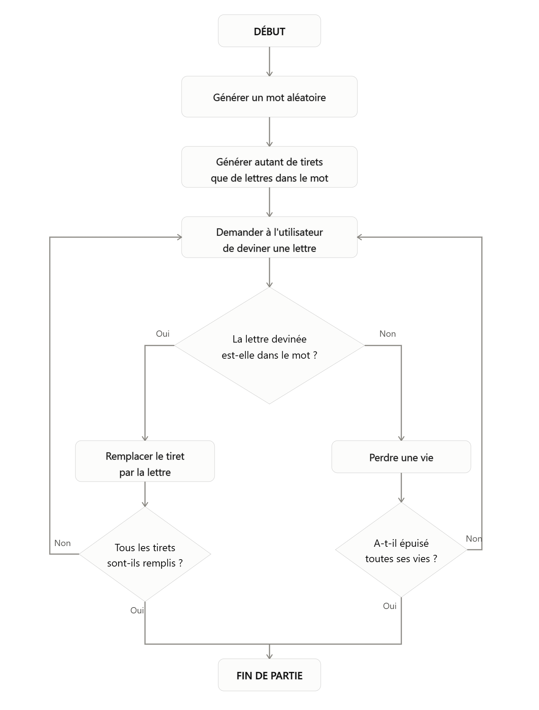
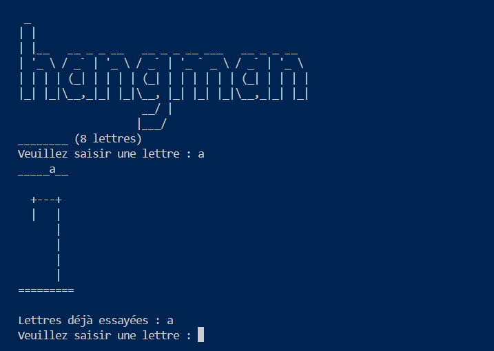
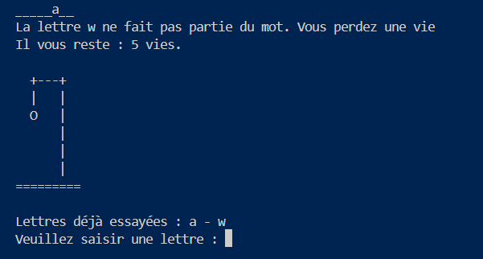
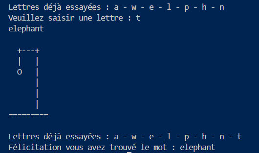

# Capstone Project : Le jeu du Pendu (Hangman)

## Table des matières
- [Contexte](#contexte)
- [En quoi ça consiste ?](#en-quoi-ça-consiste-)
- [Règles du jeu](#règles-du-jeu)
- [Concepts Python utilisés](#concepts-python-utilisés)
- [Aperçu](#aperçu)

## Contexte
Il s'agit d'un projet capstone réalisé dans le cadre du cours [100 Days of Code d'Angela Yu](https://www.udemy.com/course/100-days-of-code/) (Udemy).

## En quoi ça consiste ?
Ce capstone consiste à recréer le jeu du Pendu à l'aide du langage Python, en console.

## Règles du jeu
1. L'ordinateur choisit secrètement un mot aléatoire dans une liste prédéfinie.
2. Le mot est affiché sous forme de tirets bas (`_`), un par lettre, pour indiquer sa longueur.
3. Le joueur propose une lettre à la fois.
4. Si la lettre fait partie du mot, elle est révélée à sa/ses position(s) correcte(s).
5. Si la lettre ne fait pas partie du mot, le joueur perd une vie et le dessin du pendu progresse.
6. Le joueur dispose de 6 vies. La partie se termine :
   - **par une victoire** si le mot est entièrement deviné avant d'épuiser les vies
   - **par une défaite** si les 6 vies sont épuisées avant de trouver le mot

## Concepts Python utilisés
- Boucles `while` (jeu principal, validation des saisies)
- Boucles `for` (parcours des lettres du mot)
- Listes (`.append()`, gestion des lettres découvertes/essayées)
- f-strings et formatage de texte
- Modules personnalisés (séparation du code en plusieurs fichiers : `hangman.py`, `stage.py`, `word_list.py`)

## Aperçu

### Début de partie

### En cours de partie

### Victoire
